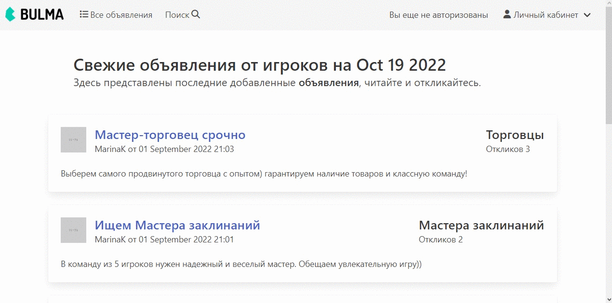

### Описание проекта



Fan-game_service-board представляет собой фанатский сервис объявлений игроков MMORPG. Благодаря своим функциям сервис выступает в качестве площадки для внеигрового взаимодействия - общения, установления договоренностей и кооперации игроков. 

Возможности сервиса:

* Каждый пользователь может просматривать список объявлений других игроков. Для удобства пользователя предусмотрен поиск по автору, дате создания, названиию и категории объявления.  
* После регистрации пользователь сервиса может создавать/редактировать/удалять объявления в различных категориях. Например объявление может помочь пользователю найти партнера в команду, продать или обменять игровые предметы.
* Также пользователь может оставлять отклики на объявления других пользователей. При создании отклика автор объявления получает уведовление на e-mail указанный при регистрации.
* Аутентифицированный пользователь получает доступ в личный кабинет(ЛК). ЛК открывает пользователю доступ к списку откликов на его объявления.
* Автор объявления может принять отклик другого пользователя и тогда автор отклика получает уведомление на e-mail.

### Стек технологий 

В ходе создания проекта применялись различные инстументы и технологии. Они представлены ниже:


### Инструкция по установке 

1. Клонируете репозиторий

```sh
git clone https://github.com/XanderMoroz/Fan-game_service-board.git
```
2. Уставливаете зависимости

3. Наслаждаетесь результатом!

### Лицензия

Лицензия не требуется. Проект может быль использован без ограничений. 

### Авторы

* [XanderMoroz](https://https://github.com/XanderMoroz/) - *Все работы*
